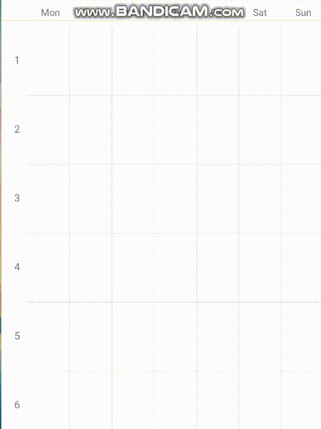
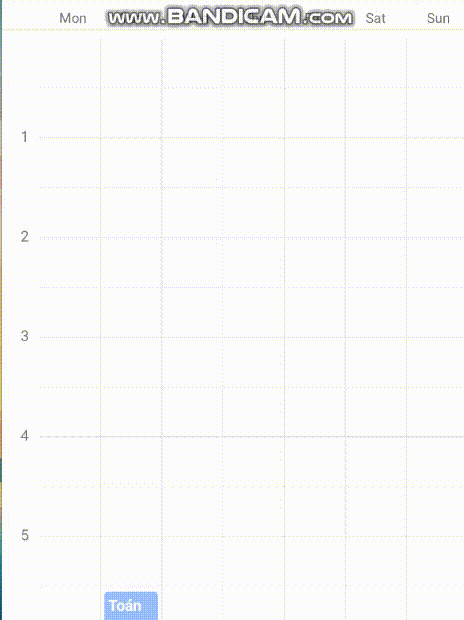
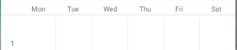
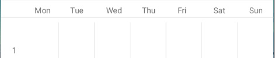

# RN-timetable

### How to install

---

```
npm install timetable-component-react-native
```

### How to use

- Image
Period Mode

Time Mode

Day Mode 1

Day Mode 2

---

```react
  const timeTableRef = useRef()
  const [timetableMode, setTimetableMode] = useState('TIME') //TIMETABLE MODE

```
- API Reference
timeTableRef.current.changeMode(): Change mode 
timeTableRef.current.reset(): reset All data in table
timeTableRef.current.addSchedule(day, timeStart,timeEnd,dataStore,option): add new time to table
- Timetable props
ref: table ref (mush have)
daysMode: 1 (six day/week) - 2 (seven day/week)
data: data input (example below)
tableMode: time(24h) or period(Default: 12 period)
numberOfPeriod: if u want more than 12 period
- use in JSX
```react
<Timetable
      daysMode={1} 
      ref={tableRef}
      HeaderHeight={100} // 0 for none
      data={[{
        mode: 'TIME',
        days: 1,
        timeStart: 20000,
        timeEnd: 40000,
        dataStore: {
          text: 'Toán',
          noteText: "Thi cuoi ky"
        },
        option:{
          boxColor:'red',
          fontColor:'green'
        }
      },
      {
        mode: 'TIME',
        days: 2,
        timeStart: 30000,
        timeEnd: 40000,
      }]}
      tableMode={'TIME'}
      onPressCreateNewEvent={(day, time) => {

      }}
      onPressEvent={(day, timeStart, timeEnd, dataStore, deleteEvent) => {
        deleteEvent()//use to delete time on point
      }}
      HeaderRenderComponent={() => {
        return (
          <Button title='Change mode' onPress={() => {
            tableRef.current.changeMode() // Change mode
          }}></ Button>
        )
      }}
    />
```

